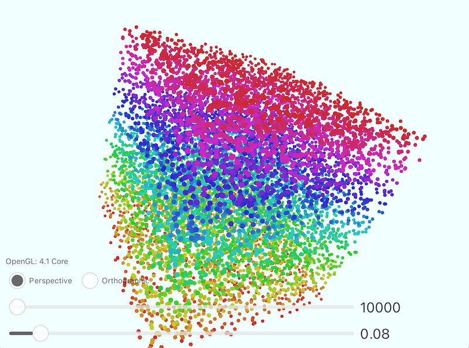
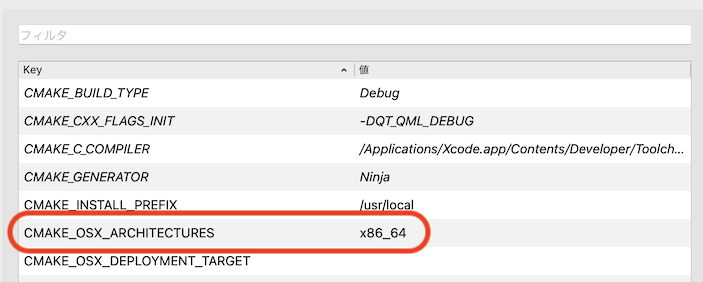

# PointSize_Qt5_Quick3D
Qt 5.15.2のQt Quick 3Dを使って、ポイントサイズを擬似的に変更するサンプルアプリ

## Demo

* マウスドラッグでキューブを回せます。
* スライダーでポイント数とサイズを変えられます。

## Features

Qt5のQt Quick 3Dでは、PrimitiveTypeがポイントに設定した時のサイズを簡単に変更することができません。
ポイントの代わりにビルボードを作成し、Shaderでポイントサイズが可変したかのように見せています。

## Requirement

* Qt Creator
* CMake
* Qt 5.15.2

## Note

通常のポイントサイズは、Perspective/Orthographic(透視投影/平行投影)のいずれでも大きさは一定です。
このサンプルアプリは擬似的にサイズを変更しているため、透視射影ではカメラからの距離によってサイズが変わってしまいます。

## Build Settings for M1 mac

このリポジトリはCMakeを使っています。
M1 macではarm64とx86_64を明示的に指定する必要があります。
ビルド設定のCMake > CMAKE_OSX_ARCHITECTURESにx86_64と記述します。
Qt 5.15.4以降はarm64にサポート外ながら[一応対応](https://www.qt.io/blog/qt-on-apple-silicon)しているようです。（このサンプルアプリもM1ネイティブで動作しましたが、スライダーの描画が壊れ気味でした。）

